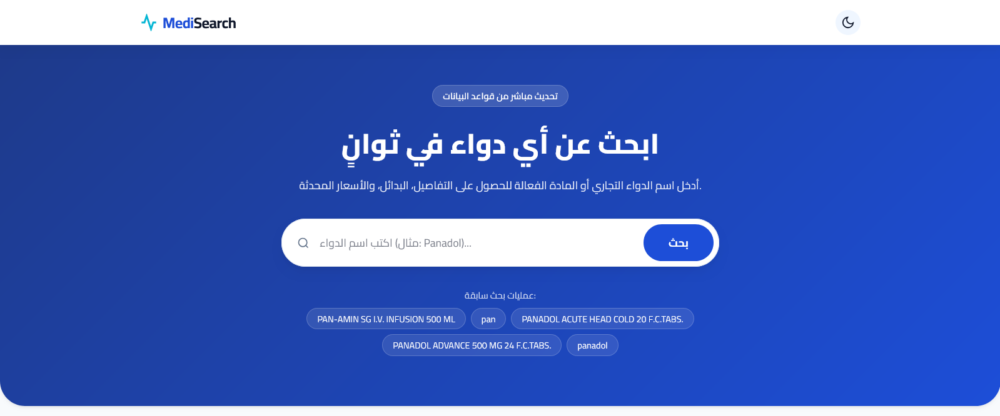
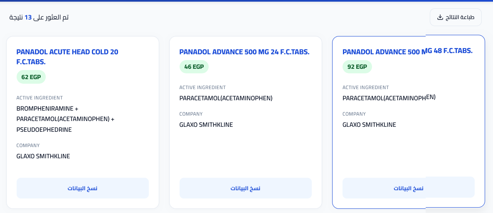

# 💊 MediSearch

<div align="center">

### AI-Powered Drug Information Search Platform

*A modern web application for searching and exploring drug information with a fast, responsive, and intuitive user experience.*


</div>

---

## 📌 About

**MediSearch** is a modern medical search platform designed to provide quick and efficient access to drug information through a clean and responsive interface.

The project focuses on delivering a smooth search experience with intelligent autocomplete, modern UI components, and a scalable architecture that allows future expansion with AI-powered features and multiple data sources.

> **⚠️ Project Status:** This project is currently under active development. New features, performance improvements, and architectural enhancements are being added continuously.

---

## ✨ Current Features

- 🔍 Live Drug Search
- ⚡ Smart Autocomplete
- 🕒 Recent Searches
- 📄 Export Search Results as PDF
- 🌙 Dark / Light Theme
- 📱 Fully Responsive Design
- 🎨 Modern Medical UI
- 🚀 Fast Search Experience
- 🧩 Modular Project Structure
- 🛡️ Error Handling

---

## 🚧 Planned Features

- 🤖 AI-Powered Search
- 📷 OCR Drug Recognition
- 🌐 Multiple Drug Information Sources
- ❤️ Favorites & Bookmarks
- 📊 Search Analytics
- 🔎 Advanced Filters
- 🌍 Multi-language Support
- 🔗 REST API
- ☁️ Cloud Deployment

---

## 🛠️ Tech Stack

### Backend

- Python
- Flask
- Requests
- BeautifulSoup4

### Frontend

- HTML5
- CSS3
- Vanilla JavaScript (ES6)

### Tools

- Git
- GitHub

---

## 📂 Project Structure

```text
MediSearch/
│
├── app.py
├── parser.py
├── requirements.txt
│
├── templates/
│   └── index.html
│
├── static/
│   ├── css/
│   ├── js/
│   └── images/
│
├── docs/
└── README.md
```

---

## 🚀 Getting Started

Clone the repository

```bash
git clone https://github.com/YOUR_USERNAME/MediSearch.git
```

Navigate to the project

```bash
cd MediSearch
```

Create a virtual environment

```bash
python -m venv .venv
```

Activate the virtual environment

Windows

```bash
.venv\Scripts\activate
```

Linux / macOS

```bash
source .venv/bin/activate
```

Install dependencies

```bash
pip install -r requirements.txt
```

Run the application

```bash
python app.py
```

---

## 📸 Screenshots


# ===============================


---

## 🎯 Project Goals

The primary objective of MediSearch is to provide a fast, modern, and user-friendly platform for searching drug information while maintaining a clean architecture that supports future enhancements such as artificial intelligence, OCR, and additional medical resources.

---

## 📅 Development Roadmap

- [x] Project Foundation
- [x] Responsive UI
- [x] Live Search
- [x] Smart Autocomplete
- [x] Recent Searches
- [x] PDF Export
- [ ] OCR Integration
- [ ] AI Search Assistant
- [ ] Multi-Source Search Engine
- [ ] REST API
- [ ] Docker Support

---

## 🤝 Contributing

Contributions, suggestions, and feedback are always welcome.

Feel free to open an issue or submit a pull request.

---

## 📄 License

This project is licensed under the MIT License.

---

## 👨‍💻 Author

**Mohamed Soliman**

Software Developer • AI • Cybersecurity

If you find this project useful, consider giving it a ⭐ on GitHub.

---

<div align="center">

### 🚧 MediSearch is actively under development.

**More exciting features are coming soon.**

</div>
